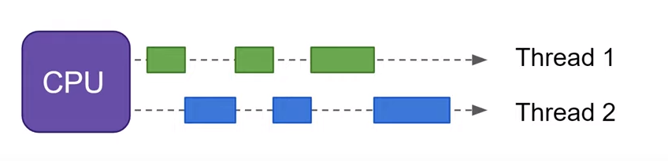
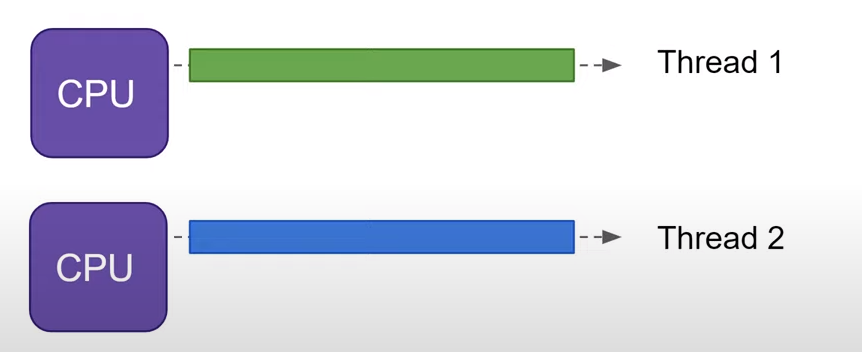
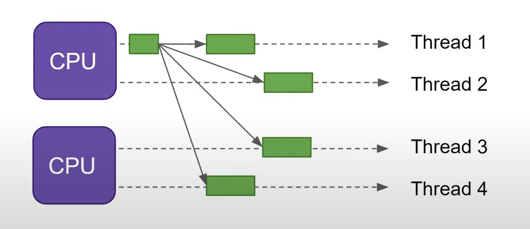

Exercise 1 - Theory questions
-----------------------------

### Concepts

What is the difference between *concurrency* and *parallelism*?

*Concurrency*

>Making progress on more than one task - seemingly at the same time.
>- Multiple threads on the same CPU.
>- Progress by switching between different threads on the same CPU  
>

*Parallel execution*

>Making progress on more than one task at the exact same time.
>- Multiple CPUs with one corresponding thread. 
>- Does not require switching of threads. 
>- Threads are executing in parallel since they are on different CPUs.
>

*Parallelism*

> Means splitting a single task into subtasks which in turn can be executed in parallel.
> - Splitting a task into subtasks.
> - Every subtask has it's own corresponding thread.
> - These threads are run on multiple CPUs such that there is *parallel execution*.
> - Combination of *concurrency* and *parallel execution*.
> 

What is the difference between a *race condition* and a *data race*? 

*Race condition*

> - Two or more operations are happening at the same time to shared data.
> - Undefined in which order threads will try to perform operations on the shared data.
> - The change in data is thus dependant on the thread scheduling.
> - Think: the threads are *racing* to access/change the shared data.

*Data race*

> Two or more threads access the same memory location (*concurrently*).
> Example: problem 3.

*Very* roughly - what does a *scheduler* do, and how does it do it?

> - Coordinate when a given number of threads should run on a CPU. 
> - Threads can exist in one of three states: ***Waiting, Runnable,*** or ***Executing***. 
> - Threads start, run, and complete in an ***interleaved*** fashion. 

*preemptive scheduling*

> - The OS decides.
> - Needs some form of time sharing system.

*Cooperative scheduling*

> - Decision of the process.

### Engineering

Why would we use multiple threads? What kinds of problems do threads solve?

> Problems that have subproblems, which can be solved by parallel execution.

Some languages support "fibers" (sometimes called "green threads") or "coroutines"? What are they, and why would we rather use them over threads?

> - Lightweight treads (similar to os-treads).
> - Cooperatively scheduled.
> - Fibers yield themselves to allow another fiber to run.
> - Cooperative scheduling(N:1) leads to the elimination of:
>   - race data
>   - dead lock
>   - live lock
> - Thread construction has overhead. Thus cutting jobs to fine will lead to a lot of overhead.
> resulting in diminishing returns.
> Fibers do not have this attribute, we are encouraged to cut jobs real fine.
> - No need for ***context switches (CS)***, since CS is only necessary because the scheduling is handled by the OS.
> There is less overhead caused by CS if we delegate the scheduling instead of the OS.
> - Threads are a finite resource.

Does creating concurrent programs make the programmer's life easier? Harder? Maybe both?

> - Introduces new problems such as raise conditions.
> - In some cases easier, problems consisting of separable sub-problems

What do you think is best - *shared variables* or *message passing*?

